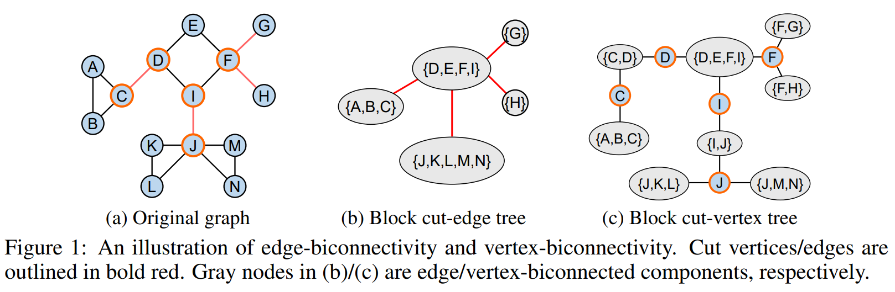
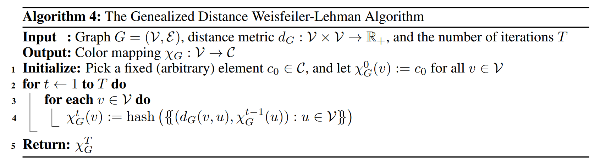

# Rethinking the Expressive Power of GNNs via Graph Biconnectivity

This repository is the official implementation of "[[ICLR 2023 notable top-5%] Rethinking the Expressive Power of GNNs via Graph Biconnectivity](https://arxiv.org/abs/2301.09505)", based on the official implementation of [Graphormer](https://github.com/microsoft/Graphormer) in [PyTorch](https://github.com/pytorch/pytorch).

> Rethinking the Expressive Power of GNNs via Graph Biconnectivity
>
> Bohang Zhang\*, Shengjie Luo\*, Liwei Wang, Di He

## 🔥 News
- **2023.04**: Our paper receives the [ICLR 2023 Outstanding Paper Award](https://blog.iclr.cc/2023/03/21/announcing-the-iclr-2023-outstanding-paper-award-recipients/)!
- **2023.03**: Codebase cleanup & release.
- **2023.01**: Our paper is accepted at ICLR 2023 and nominated as notable top 5%!

## Overview
- Beyond the WL test, we propose a fundamentally different perspective, a novel class of expressivity metrics via 🚀Graph Biconnectivity🚀, to study the expressive power of GNNs.
  - 
- Through the lens of graph biconnectivity, we systematically investigate popular GNNs including classic MPNNs, Graph Substructure Networks (GSN) and its variant, GNN with lifting transformations (MPSN and CWN), GraphSNN, and Subgraph GNNs. The thorough analysis provide a fine-grained understanding on the expressive power of existing GNNs.
  - 
- Based on the above theoretical analysis, we develop a principled and more efficient approach, called the Generalized Distance Weisfeiler-Lehman (GD-WL), which is provably expressive for all biconnectivity metrics.
  - 
- We further develop Graphormer-GD to implement the GD-WL, which is a Transformer-like architecture that preserves expressiveness and enjoys full parallelizability.

## Installation

- Clone this repository

```shell
git clone https://github.com/lsj2408/Graphormer-GD.git
```

- Install the dependencies (Using [Anaconda](https://www.anaconda.com/), tested with CUDA version 11.1)

```shell
conda create -n Graphormer-GD python==3.9
conda activate Graphormer-GD
# install requirements
pip install torch==1.9.1+cu111 torchaudio -f https://download.pytorch.org/whl/cu111/torch_stable.html
# install torchaudio, thus fairseq installation will not install newest torchaudio and torch(would replace torch-1.9.1)
pip install lmdb
pip install torch-scatter==2.0.9 -f https://pytorch-geometric.com/whl/torch-1.9.1+cu111.html
pip install torch-sparse==0.6.12 -f https://pytorch-geometric.com/whl/torch-1.9.1+cu111.html
pip install torch-geometric==1.7.2
pip install tensorboardX==2.4.1
pip install ogb==1.3.2
pip install rdkit-pypi==2021.9.3
pip install dgl==0.7.2 -f https://data.dgl.ai/wheels/repo.html

cd engine
pip install -e .
python setup.py build_ext --inplace
```

## Training
- Biconnectivity
- Graph Representation Learning (ZINC)
- Node Classification (Brazil-Airports & Europe-Airports)

## Citation

If you find this work useful, please kindly cite following papers:

```latex
@inproceedings{
zhang2023rethinking,
title={Rethinking the Expressive Power of {GNN}s via Graph Biconnectivity},
author={Bohang Zhang and Shengjie Luo and Liwei Wang and Di He},
booktitle={International Conference on Learning Representations},
year={2023},
url={https://openreview.net/forum?id=r9hNv76KoT3}
}

@inproceedings{
luo2022your,
title={Your Transformer May Not be as Powerful as You Expect},
author={Shengjie Luo and Shanda Li and Shuxin Zheng and Tie-Yan Liu and Liwei Wang and Di He},
booktitle={Advances in Neural Information Processing Systems},
editor={Alice H. Oh and Alekh Agarwal and Danielle Belgrave and Kyunghyun Cho},
year={2022},
url={https://openreview.net/forum?id=NQFFNdsOGD}

@article{ying2021transformers,
  title={Do transformers really perform badly for graph representation?},
  author={Ying, Chengxuan and Cai, Tianle and Luo, Shengjie and Zheng, Shuxin and Ke, Guolin and He, Di and Shen, Yanming and Liu, Tie-Yan},
  journal={Advances in Neural Information Processing Systems},
  volume={34},
  pages={28877--28888},
  year={2021}
}
}
```

## Contact

Bohang Zhang (zhangbohang@pku.edu.cn) Shengjie Luo (luosj@stu.pku.edu.cn)

Sincerely appreciate your suggestions on our work!

## License

This project is licensed under the terms of the MIT license. See [LICENSE](https://github.com/lsj2408/Transformer-M/blob/main/LICENSE) for additional details.
